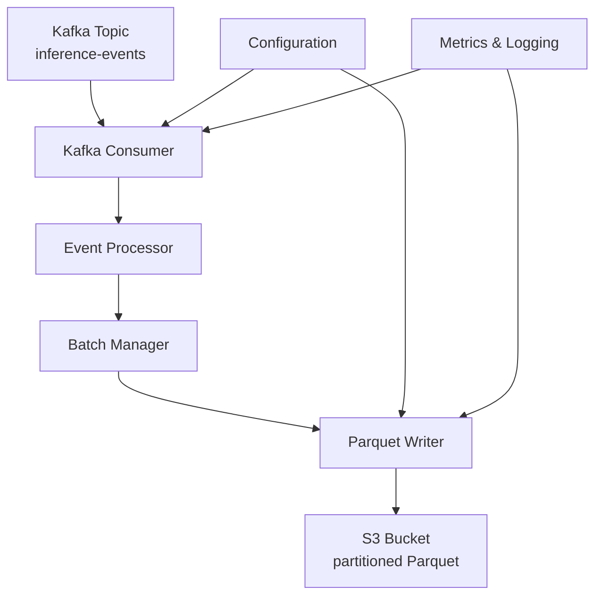

# Kafka to Parquet Pipeline

## Overview

The `kafka_to_parquet` module implements a pipeline for consuming inference events from Apache Kafka, processing them, and saving them in Parquet format to Amazon S3. This enables archiving inference data for subsequent analysis, model training, and drift monitoring.

## Architecture



### Components

1. **Kafka Consumer** (`kafka_consumer.py`)
   - Consumes events from Kafka topic
   - Supports state management (IDLE, POLLING, PROCESSING, STOPPING, ERROR)
   - Processes messages in batches for efficiency
   - Includes error handling and retries

2. **Event Processor** (`kafka_consumer.py`)
   - Validates and enriches events
   - Extracts date fields (year, month, day) for partitioning
   - Flattens top-k predictions into separate columns
   - Adds processing metadata

3. **Batch Manager** (`kafka_consumer.py`)
   - Manages event batches
   - Triggers based on batch size or time interval
   - Calls callback for processing ready batches
   - Handles errors through error callback

4. **Parquet Writer** (`parquet_writer.py`)
   - Creates Parquet schema based on event structure
   - Converts event batches to PyArrow tables
   - Writes Parquet files to temporary storage
   - Uploads files to S3 with multipart upload support

5. **S3 Uploader** (`parquet_writer.py`)
   - Generates S3 keys with Hive-style partitioning
   - Uploads files to S3 with exponential backoff strategy
   - Supports multipart upload for large files
   - Deletes temporary files after successful upload

6. **Metrics Integration** (`metrics_integration.py`)
   - Collects consumption and write metrics
   - Logs metrics in JSON format for integration with existing monitoring system
   - Supports periodic logging

## Configuration

### Kafka Consumer Parameters

```yaml
kafka:
  bootstrap_servers: "localhost:9092"
  topic: "inference-events"
  consumer:
    enabled: true
    group_id: "kafka-to-parquet-group"
    max_poll_records: 100
    auto_offset_reset: "earliest"
    enable_auto_commit: false
    session_timeout_ms: 45000
    heartbeat_interval_ms: 3000
    max_poll_interval_ms: 300000
```

### Parquet Writer Parameters

```yaml
parquet:
  s3_bucket: "your-data-bucket"
  s3_region: "us-east-1"
  s3_prefix: "inference-events/parquet"
  batch_size: 1000
  flush_interval_seconds: 60
  compression: "snappy"
  max_file_size_mb: 128
  enable_s3_multipart: true
  partition_columns: ["year", "month", "day"]
  metrics_log_every: 60
```

### Complete Configuration Example

See `config.example.yaml` for a complete example with all parameters and comments.

## Installation and Startup

### 1. Install Dependencies

```bash
pip install -r requirements.txt
```

Required dependencies:
- `kafka-python>=2.0.2`
- `pyarrow>=17.0.0`
- `boto3>=1.34.0`
- `pydantic>=2.0.0`

### 2. Configure Settings

Copy the example configuration and customize for your environment:

```bash
cp config.example.yaml config.yaml
# Edit config.yaml
```

### 3. Run the Pipeline

```bash
python run_kafka_to_parquet.py
```

### 4. Run as a Service (systemd)

Create a service file `/etc/systemd/system/kafka-to-parquet.service`:

```ini
[Unit]
Description=Kafka to Parquet Pipeline
After=network.target kafka.service

[Service]
Type=simple
User=appuser
WorkingDirectory=/opt/stream-video-processing
Environment=PYTHONPATH=/opt/stream-video-processing
ExecStart=/usr/bin/python3 /opt/stream-video-processing/run_kafka_to_parquet.py
Restart=on-failure
RestartSec=10

[Install]
WantedBy=multi-user.target
```

## Monitoring

### Metrics

The pipeline collects the following metrics:

- `consumer_messages_received` - number of messages received
- `consumer_messages_processed` - number of successfully processed messages
- `consumer_errors` - number of errors during processing
- `batches_written` - number of batches written
- `events_written` - number of events written
- `s3_upload_errors` - number of S3 upload errors
- `processing_rate_per_second` - processing speed (events/sec)

Metrics are logged in JSON format every `parquet_metrics_log_every` seconds:

```json
{
  "component": "kafka_to_parquet",
  "timestamp": "2025-03-09T18:30:45.123456Z",
  "consumer_messages_received": 1500,
  "consumer_messages_processed": 1485,
  "consumer_errors": 2,
  "batches_written": 15,
  "events_written": 1485,
  "s3_upload_errors": 0,
  "processing_rate_per_second": 24.75,
  "uptime_seconds": 3600
}
```

### Logs

The pipeline uses standard Python logging with INFO level. Key events:

- `INFO` - startup/shutdown, statistics, successful uploads
- `WARNING` - temporary errors, retries
- `ERROR` - critical errors, inability to continue

## Data Structure

### Input Events (Kafka)

Events must conform to the `schemas/inference_event.json` schema:

```json
{
  "event_id": "uuid",
  "timestamp": "2025-01-01T12:00:00Z",
  "model_name": "resnet50",
  "predictions": [
    {"class_id": 1, "class_name": "person", "confidence": 0.95},
    {"class_id": 2, "class_name": "car", "confidence": 0.03}
  ],
  "metadata": {
    "frame_id": 100,
    "camera_id": "cam-001",
    "processing_time_ms": 45.2
  }
}
```

### Output Data (Parquet)

Parquet files contain the following columns:

| Column | Type | Description |
|---------|------|-------------|
| event_id | string | Unique event identifier |
| timestamp | string | Event timestamp (ISO 8601) |
| model_name | string | Model name |
| processing_timestamp | string | Event processing time |
| year | int32 | Year from timestamp |
| month | int32 | Month from timestamp |
| day | int32 | Day from timestamp |
| top1_class_id | int32 | Class ID with highest confidence |
| top1_class_name | string | Class name with highest confidence |
| top1_confidence | float32 | Top-1 class confidence |
| top2_class_id | int32 | Second class ID |
| top2_class_name | string | Second class name |
| top2_confidence | float32 | Top-2 class confidence |
| top3_class_id | int32 | Third class ID |
| top3_class_name | string | Third class name |
| top3_confidence | float32 | Top-3 class confidence |
| frame_id | int32 | Frame ID |
| camera_id | string | Camera ID |
| processing_time_ms | float32 | Processing time in milliseconds |

### Partitioning

Data is partitioned in S3 using Hive-style scheme:

```
s3://bucket/prefix/year=2025/month=01/day=01/events_20250101_120000.parquet
```

Partitioning is configured via `parquet_partition_columns`. Default: `["year", "month", "day"]`.

## Error Handling

### S3 Upload Retries

On S3 upload errors, up to 3 retry attempts are performed with exponential backoff:

1. First attempt: immediately
2. Second attempt: after 2 seconds
3. Third attempt: after 4 seconds

### Dead Letter Queue

Invalid events (failing validation) are logged with ERROR level but not saved to Parquet. Consider implementing a Dead Letter Queue for such events.

### Graceful Shutdown

The pipeline handles SIGINT and SIGTERM signals for graceful shutdown:
1. Stops consuming new messages
2. Completes processing of current batch
3. Writes remaining events to Parquet
4. Closes Kafka and S3 connections

## Testing

### Unit Tests

```bash
pytest tests/test_kafka_to_parquet.py -v
```

Tests cover:
- Consumer initialization and state management
- Event processing and field extraction
- Batch management (size and time)
- Parquet schema and table creation
- S3 upload with mocks
- Metrics collection

### Integration Tests

Integration tests require:
1. Running Kafka broker
2. Access to S3 bucket (or mock S3)
3. Test data

See `tests/test_stream_integration.py` for an integration test example.

## Performance

### High Load Settings

```yaml
kafka:
  consumer:
    max_poll_records: 1000
    max_poll_interval_ms: 300000

parquet:
  batch_size: 5000
  flush_interval_seconds: 30
  max_file_size_mb: 256
  enable_s3_multipart: true
```

### Performance Monitoring

Use the `processing_rate_per_second` metric to monitor performance. Typical values:

- 100-500 events/sec: low load
- 500-2000 events/sec: medium load
- 2000+ events/sec: high load

## Integration with Existing System

### Existing Kafka Producer

The pipeline consumes events generated by `src/ingest/metadata_producer.py`. Ensure that:
1. Producer sends events to the same topic
2. Events conform to the `inference_event.json` schema
3. Producer uses the same `bootstrap_servers`

### Existing Metrics System

Pipeline metrics are integrated with the existing system via JSON logging. Logs follow the same format as `src/metrics.py`.

### Configuration

Configuration extends the existing system via `src/config.py`. All parameters are accessible through `Settings` and `YamlSettings` classes.

## Deployment

### Docker

```dockerfile
FROM python:3.11-slim

WORKDIR /app
COPY requirements.txt .
RUN pip install --no-cache-dir -r requirements.txt

COPY . .

CMD ["python", "run_kafka_to_parquet.py"]
```

### AWS ECS

Use the task definition in `infra/ecs-task-def.json` as a base. Add:
- Environment variables for configuration
- IAM role with S3 access
- Health checks

### Kubernetes

Example Deployment:

```yaml
apiVersion: apps/v1
kind: Deployment
metadata:
  name: kafka-to-parquet
spec:
  replicas: 2
  selector:
    matchLabels:
      app: kafka-to-parquet
  template:
    metadata:
      labels:
        app: kafka-to-parquet
    spec:
      containers:
      - name: consumer
        image: your-registry/kafka-to-parquet:latest
        env:
        - name: KAFKA_BOOTSTRAP_SERVERS
          value: "kafka-broker:9092"
        - name: PARQUET_S3_BUCKET
          value: "inference-data"
        resources:
          requests:
            memory: "512Mi"
            cpu: "250m"
          limits:
            memory: "1Gi"
            cpu: "500m"
```

## Troubleshooting

### Common Issues

1. **Consumer not receiving messages**
   - Check `bootstrap_servers` and Kafka availability
   - Ensure consumer group_id is unique
   - Check `auto_offset_reset` (earliest/latest)

2. **S3 upload errors**
   - Check IAM permissions
   - Ensure bucket exists and is accessible
   - Verify S3 region

3. **High processing latency**
   - Increase `max_poll_records`
   - Decrease `flush_interval_seconds`
   - Check network latency to S3

4. **Memory growing**
   - Decrease `batch_size`
   - Increase `flush_interval_seconds`
   - Check for memory leaks in event processing

### Debug Logs

Set logging level to DEBUG for detailed debugging:

```python
import logging
logging.getLogger("src.kafka_to_parquet").setLevel(logging.DEBUG)
```

## Future Development

### Planned Improvements

1. **Parquet file compaction** - merging small files into larger ones
2. **Schema evolution** - support for Parquet schema evolution
3. **Multiple output formats** - support for Avro, ORC
4. **Streaming to Data Lake** - integration with AWS Glue Data Catalog
5. **Exactly-once semantics** - using Kafka transactions

### Contribution

1. Fork the repository
2. Create a feature branch
3. Implement changes with tests
4. Open a Pull Request