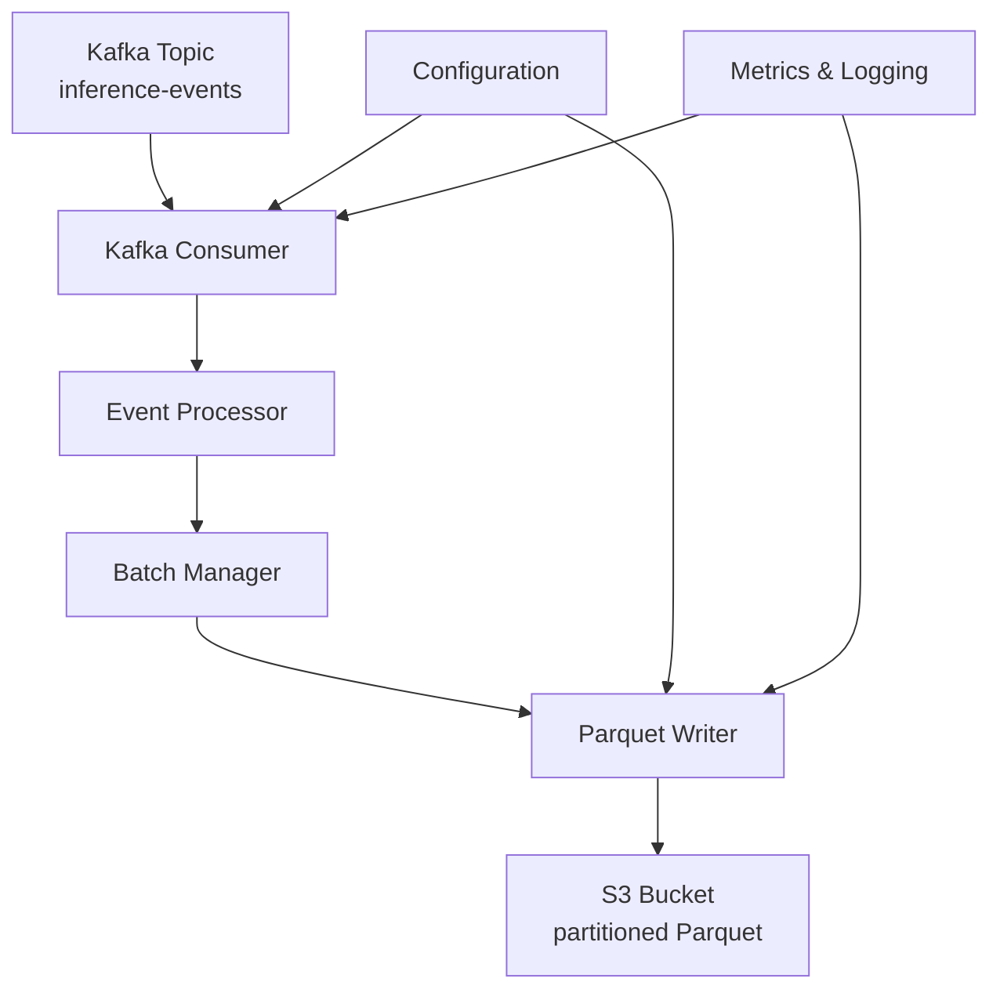

# Kafka to Parquet Pipeline

## Обзор

Модуль `kafka_to_parquet` реализует конвейер для потребления событий вывода (inference events) из Apache Kafka, их обработки и сохранения в формате Parquet в Amazon S3. Это позволяет архивировать данные вывода для последующего анализа, обучения моделей и мониторинга дрейфа.

## Архитектура



### Компоненты

1. **Kafka Consumer** (`kafka_consumer.py`)
   - Потребляет события из топика Kafka
   - Поддерживает управление состоянием (IDLE, POLLING, PROCESSING, STOPPING, ERROR)
   - Обрабатывает сообщения батчами для эффективности
   - Включает обработку ошибок и повторные попытки

2. **Event Processor** (`kafka_consumer.py`)
   - Валидирует и обогащает события
   - Извлекает поля даты (год, месяц, день) для партиционирования
   - "Расплющивает" предсказания top-k в отдельные колонки
   - Добавляет метаданные обработки

3. **Batch Manager** (`kafka_consumer.py`)
   - Управляет батчами событий
   - Срабатывает по размеру батча или временному интервалу
   - Вызывает callback для обработки готовых батчей
   - Обрабатывает ошибки через error callback

4. **Parquet Writer** (`parquet_writer.py`)
   - Создает схему Parquet на основе структуры событий
   - Конвертирует батчи событий в таблицы PyArrow
   - Записывает Parquet файлы во временное хранилище
   - Загружает файлы в S3 с поддержкой multipart upload

5. **S3 Uploader** (`parquet_writer.py`)
   - Генерирует S3 ключи с Hive-style партиционированием
   - Загружает файлы в S3 с экспоненциальной backoff стратегией
   - Поддерживает multipart upload для больших файлов
   - Удаляет временные файлы после успешной загрузки

6. **Metrics Integration** (`metrics_integration.py`)
   - Собирает метрики потребления и записи
   - Логирует метрики в JSON формате для интеграции с существующей системой мониторинга
   - Поддерживает периодическое логирование

## Конфигурация

### Параметры Kafka Consumer

```yaml
kafka:
  bootstrap_servers: "localhost:9092"
  topic: "inference-events"
  consumer:
    enabled: true
    group_id: "kafka-to-parquet-group"
    max_poll_records: 100
    auto_offset_reset: "earliest"
    enable_auto_commit: false
    session_timeout_ms: 45000
    heartbeat_interval_ms: 3000
    max_poll_interval_ms: 300000
```

### Параметры Parquet Writer

```yaml
parquet:
  s3_bucket: "your-data-bucket"
  s3_region: "us-east-1"
  s3_prefix: "inference-events/parquet"
  batch_size: 1000
  flush_interval_seconds: 60
  compression: "snappy"
  max_file_size_mb: 128
  enable_s3_multipart: true
  partition_columns: ["year", "month", "day"]
  metrics_log_every: 60
```

### Полный пример конфигурации

Смотрите `config.example.yaml` для полного примера со всеми параметрами и комментариями.

## Установка и запуск

### 1. Установка зависимостей

```bash
pip install -r requirements.txt
```

Требуемые зависимости:
- `kafka-python>=2.0.2`
- `pyarrow>=17.0.0`
- `boto3>=1.34.0`
- `pydantic>=2.0.0`

### 2. Настройка конфигурации

Скопируйте пример конфигурации и настройте под ваше окружение:

```bash
cp config.example.yaml config.yaml
# Отредактируйте config.yaml
```

### 3. Запуск конвейера

```bash
python run_kafka_to_parquet.py
```

### 4. Запуск как сервис (systemd)

Создайте файл сервиса `/etc/systemd/system/kafka-to-parquet.service`:

```ini
[Unit]
Description=Kafka to Parquet Pipeline
After=network.target kafka.service

[Service]
Type=simple
User=appuser
WorkingDirectory=/opt/stream-video-processing
Environment=PYTHONPATH=/opt/stream-video-processing
ExecStart=/usr/bin/python3 /opt/stream-video-processing/run_kafka_to_parquet.py
Restart=on-failure
RestartSec=10

[Install]
WantedBy=multi-user.target
```

## Мониторинг

### Метрики

Конвейер собирает следующие метрики:

- `consumer_messages_received` - количество полученных сообщений
- `consumer_messages_processed` - количество успешно обработанных сообщений
- `consumer_errors` - количество ошибок при обработке
- `batches_written` - количество записанных батчей
- `events_written` - количество записанных событий
- `s3_upload_errors` - количество ошибок загрузки в S3
- `processing_rate_per_second` - скорость обработки (событий/сек)

Метрики логируются в JSON формате каждые `parquet_metrics_log_every` секунд:

```json
{
  "component": "kafka_to_parquet",
  "timestamp": "2025-03-09T18:30:45.123456Z",
  "consumer_messages_received": 1500,
  "consumer_messages_processed": 1485,
  "consumer_errors": 2,
  "batches_written": 15,
  "events_written": 1485,
  "s3_upload_errors": 0,
  "processing_rate_per_second": 24.75,
  "uptime_seconds": 3600
}
```

### Логи

Конвейер использует стандартное логирование Python с уровнем INFO. Ключевые события:

- `INFO` - запуск/остановка, статистика, успешные загрузки
- `WARNING` - временные ошибки, повторные попытки
- `ERROR` - критические ошибки, невозможность продолжить работу

## Структура данных

### Входные события (Kafka)

События должны соответствовать схеме `schemas/inference_event.json`:

```json
{
  "event_id": "uuid",
  "timestamp": "2025-01-01T12:00:00Z",
  "model_name": "resnet50",
  "predictions": [
    {"class_id": 1, "class_name": "person", "confidence": 0.95},
    {"class_id": 2, "class_name": "car", "confidence": 0.03}
  ],
  "metadata": {
    "frame_id": 100,
    "camera_id": "cam-001",
    "processing_time_ms": 45.2
  }
}
```

### Выходные данные (Parquet)

Parquet файлы содержат следующие колонки:

| Колонка | Тип | Описание |
|---------|-----|----------|
| event_id | string | Уникальный идентификатор события |
| timestamp | string | Временная метка события (ISO 8601) |
| model_name | string | Название модели |
| processing_timestamp | string | Время обработки события |
| year | int32 | Год из timestamp |
| month | int32 | Месяц из timestamp |
| day | int32 | День из timestamp |
| top1_class_id | int32 | ID класса с наибольшей уверенностью |
| top1_class_name | string | Название класса с наибольшей уверенностью |
| top1_confidence | float32 | Уверенность top-1 класса |
| top2_class_id | int32 | ID второго класса |
| top2_class_name | string | Название второго класса |
| top2_confidence | float32 | Уверенность top-2 класса |
| top3_class_id | int32 | ID третьего класса |
| top3_class_name | string | Название третьего класса |
| top3_confidence | float32 | Уверенность top-3 класса |
| frame_id | int32 | ID кадра |
| camera_id | string | ID камеры |
| processing_time_ms | float32 | Время обработки в миллисекундах |

### Партиционирование

Данные партиционируются в S3 по схеме Hive-style:

```
s3://bucket/prefix/year=2025/month=01/day=01/events_20250101_120000.parquet
```

Партиционирование настраивается через `parquet_partition_columns`. По умолчанию: `["year", "month", "day"]`.

## Обработка ошибок

### Повторные попытки S3 Upload

При ошибках загрузки в S3 выполняется до 3 повторных попыток с экспоненциальным backoff:

1. Первая попытка: немедленно
2. Вторая попытка: через 2 секунды
3. Третья попытка: через 4 секунды

### Dead Letter Queue

Некорректные события (не прошедшие валидацию) логируются с уровнем ERROR, но не сохраняются в Parquet. Рассмотрите возможность реализации Dead Letter Queue для таких событий.

### Graceful Shutdown

Конвейер обрабатывает сигналы SIGINT и SIGTERM для graceful shutdown:
1. Останавливает потребление новых сообщений
2. Завершает обработку текущего батча
3. Записывает оставшиеся события в Parquet
4. Закрывает соединения с Kafka и S3

## Тестирование

### Unit тесты

```bash
pytest tests/test_kafka_to_parquet.py -v
```

Тесты покрывают:
- Инициализацию и управление состоянием consumer
- Обработку событий и извлечение полей
- Управление батчами (размер и время)
- Создание схемы Parquet и таблиц
- Загрузку в S3 с моками
- Сбор метрик

### Интеграционные тесты

Для интеграционных тестов требуется:
1. Запущенный Kafka broker
2. Доступ к S3 bucket (или мок S3)
3. Тестовые данные

Пример интеграционного теста см. в `tests/test_stream_integration.py`.

## Производительность

### Настройки для высокой нагрузки

```yaml
kafka:
  consumer:
    max_poll_records: 1000
    max_poll_interval_ms: 300000

parquet:
  batch_size: 5000
  flush_interval_seconds: 30
  max_file_size_mb: 256
  enable_s3_multipart: true
```

### Мониторинг производительности

Используйте метрики `processing_rate_per_second` для мониторинга производительности. Типичные значения:

- 100-500 событий/сек: низкая нагрузка
- 500-2000 событий/сек: средняя нагрузка
- 2000+ событий/сек: высокая нагрузка

## Интеграция с существующей системой

### Существующий Kafka Producer

Конвейер потребляет события, создаваемые `src/ingest/metadata_producer.py`. Убедитесь, что:
1. Producer отправляет события в тот же топик
2. События соответствуют схеме `inference_event.json`
3. Producer использует тот же `bootstrap_servers`

### Существующая система метрик

Метрики конвейера интегрированы с существующей системой через JSON логирование. Логи имеют тот же формат, что и `src/metrics.py`.

### Конфигурация

Конфигурация расширяет существующую систему через `src/config.py`. Все параметры доступны через `Settings` и `YamlSettings` классы.

## Развертывание

### Docker

```dockerfile
FROM python:3.11-slim

WORKDIR /app
COPY requirements.txt .
RUN pip install --no-cache-dir -r requirements.txt

COPY . .

CMD ["python", "run_kafka_to_parquet.py"]
```

### AWS ECS

Используйте task definition в `infra/ecs-task-def.json` как основу. Добавьте:
- Переменные окружения для конфигурации
- IAM роль с доступом к S3
- Health checks

### Kubernetes

Пример Deployment:

```yaml
apiVersion: apps/v1
kind: Deployment
metadata:
  name: kafka-to-parquet
spec:
  replicas: 2
  selector:
    matchLabels:
      app: kafka-to-parquet
  template:
    metadata:
      labels:
        app: kafka-to-parquet
    spec:
      containers:
      - name: consumer
        image: your-registry/kafka-to-parquet:latest
        env:
        - name: KAFKA_BOOTSTRAP_SERVERS
          value: "kafka-broker:9092"
        - name: PARQUET_S3_BUCKET
          value: "inference-data"
        resources:
          requests:
            memory: "512Mi"
            cpu: "250m"
          limits:
            memory: "1Gi"
            cpu: "500m"
```

## Устранение неполадок

### Common Issues

1. **Consumer не получает сообщения**
   - Проверьте `bootstrap_servers` и доступность Kafka
   - Убедитесь, что consumer group_id уникален
   - Проверьте `auto_offset_reset` (earliest/latest)

2. **Ошибки загрузки в S3**
   - Проверьте IAM permissions
   - Убедитесь, что bucket существует и доступен
   - Проверьте регион S3

3. **Высокая задержка обработки**
   - Увеличьте `max_poll_records`
   - Уменьшите `flush_interval_seconds`
   - Проверьте сетевую задержку до S3

4. **Память растет**
   - Уменьшите `batch_size`
   - Увеличьте `flush_interval_seconds`
   - Проверьте утечки памяти в обработке событий

### Логи для отладки

Установите уровень логирования DEBUG для детальной отладки:

```python
import logging
logging.getLogger("src.kafka_to_parquet").setLevel(logging.DEBUG)
```

## Дальнейшее развитие

### Планируемые улучшения

1. **Compaction Parquet файлов** - объединение мелких файлов в более крупные
2. **Schema evolution** - поддержка эволюции схемы Parquet
3. **Multiple output formats** - поддержка Avro, ORC
4. **Streaming to Data Lake** - интеграция с AWS Glue Data Catalog
5. **Exactly-once semantics** - использование Kafka transactions

### Контрибьюция

1. Форкните репозиторий
2. Создайте feature branch
3. Реализуйте изменения с тестами
4. Откройте Pull Request

## Лицензия

Проект использует ту же лицензию, что и основной репозиторий stream-video-processing.

## Контакты

Для вопросов и поддержки обратитесь к команде разработки или создайте issue в репозитории.