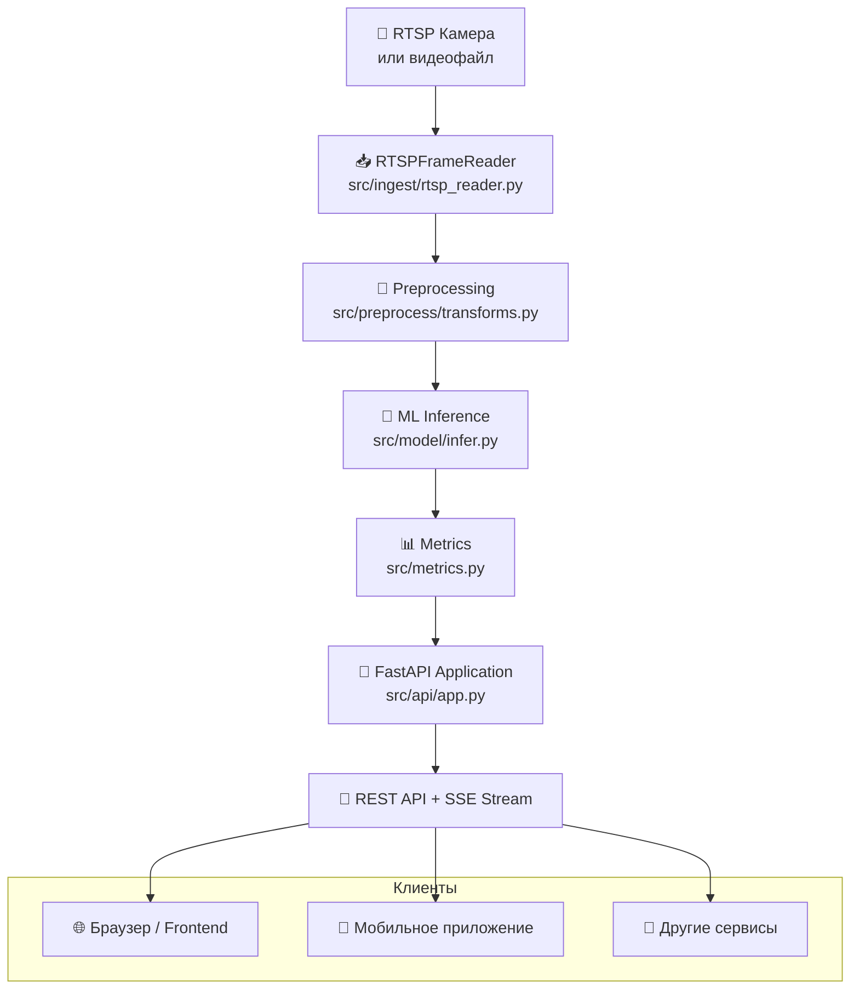

# Сервис обработки видео в реальном времени с машинным обучением - Stream ML Service

Он берёт видео (RTSP-камера или видеофайл), анализирует каждый кадр нейросетью и отдаёт результаты через API.

## 1. Общая схема работы

## 2. Основные компоненты

| Компонент              | Файл                          | Что делает |
|------------------------|-------------------------------|----------|
| **FastAPI приложение** | `src/api/app.py`              | Главный веб-сервер. Запускает всё остальное при старте |
| **Чтение видео**       | `src/ingest/rtsp_reader.py`   | Читает RTSP или mp4, автоматически переподключается при обрыве |
| **Предобработка**      | `src/preprocess/transforms.py`| Конвертация BGR→RGB, ресайз, нормализация |
| **Нейросеть**          | `src/model/infer.py`          | Загружает и запускает модель (MobileNetV3 / ResNet50 и др.) |
| **Метрики**            | `src/metrics.py`              | Считает FPS, latency, ошибки |
| **Конфигурация**       | `src/config.py`               | Читает `config.example.yaml` + переменные `APP_*` из `.env` |

## 3. Как всё запускается (Docker)

`docker-compose.yml` запускает сервисы:

- `api` — главное приложение (FastAPI + модель)
- `zookeeper` + `kafka` (опционально, сейчас отключены)

При старте контейнера `api`:

1. Загружается ML-модель в память
2. Запускается `RTSPFrameReader`
3. Uvicorn начинает слушать порт `8000`

## 4. Как работает обработка кадров

Каждые `APP_FRAME_SAMPLE_FPS` секунд (сейчас 5):

1. Берётся новый кадр из видео
2. Кадр ресайзится и нормализуется
3. Отправляется в нейросеть
4. Результат (классы + вероятности) отправляется клиенту через **SSE** (`/stream`)

## 5. Доступные эндпоинты

| Эндпоинт            | Метод | Что возвращает |
|---------------------|-------|----------------|
| `/health`           | GET   | Простой статус сервера |
| `/health/stream`    | GET   | Проверка доступности RTSP |
| `/predict`          | POST  | Предсказание на одной загруженной картинке |
| `/stream`           | GET   | **Бесконечный поток** JSON с предсказаниями (SSE) |

Самый полезный — `/stream`. Его можно открыть в браузере и видеть живые предсказания в реальном времени.

## 6. Текущая ситуация на VPS

- Работает **локальный видеофайл** `test.mp4` (вместо RTSP)
- Модель: `mobilenet_v3_small` (лёгкая)
- Kafka полностью отключён
- Ограничение памяти: **1.5 ГБ** на сервис `api`
- Доступ: `http://178.208.88.6:8000`

## 7. Как обновлять проект

1. Изменяешь код на ноутбуке
2. Делаешь `git push`
3. GitHub Actions автоматически собирает новый Docker-образ
4. VPS подтягивает новый образ и перезапускает контейнер