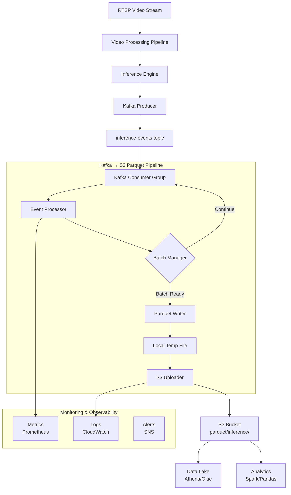
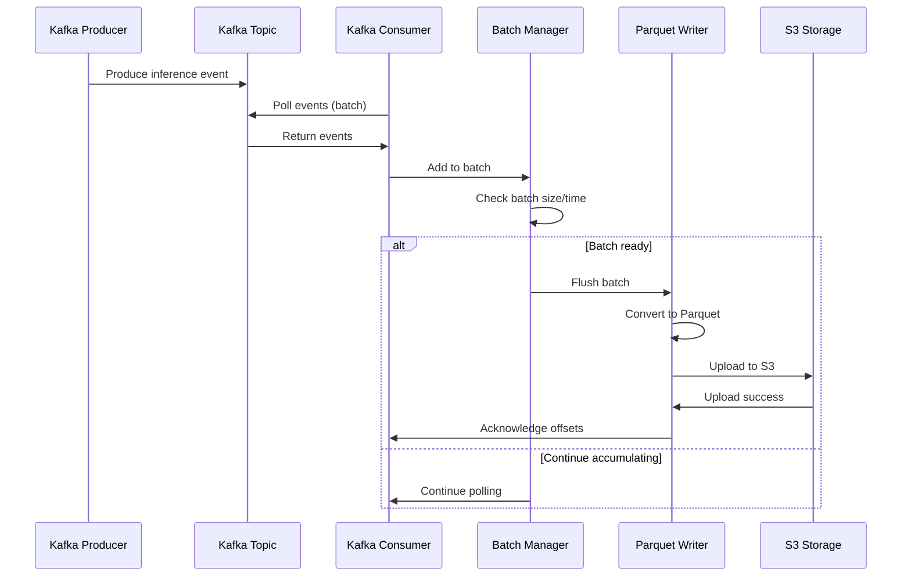

# Архитектура пайплайна Kafka → S3 Parquet

## Обзор
Пайплайн для чтения событий инференса из Kafka, преобразования в формат Parquet и сохранения в S3 с партиционированием по времени.

## Диаграмма архитектуры



## Компоненты

### 1. Kafka Producer (существующий)
- **Расположение**: `src/ingest/metadata_producer.py`
- **Функция**: Отправка событий инференса в Kafka топик
- **Формат данных**: JSON согласно схеме `schemas/inference_event.json`
- **Настройки**: `streaming_backend: kafka`, `kafka_bootstrap_servers`, `kafka_topic`

### 2. Kafka Consumer
- **Новый модуль**: `src/kafka_consumer/`
- **Компоненты**:
  - `KafkaEventConsumer`: Основной консьюмер с настройками группы
  - `EventProcessor`: Обработка и валидация событий
  - `BatchManager`: Управление батчами событий
- **Настройки**:
  - `kafka_consumer_group_id`: Идентификатор группы консьюмеров
  - `kafka_auto_offset_reset`: earliest/latest
  - `kafka_max_poll_records`: Максимальное количество записей за poll
  - `parquet_batch_size`: Размер батча в событиях
  - `parquet_flush_interval_seconds`: Таймаут сброса батча

### 3. Parquet Writer
- **Новый модуль**: `src/parquet_writer/`
- **Компоненты**:
  - `ParquetSchemaManager`: Управление схемой Parquet
  - `S3ParquetWriter`: Преобразование событий в Parquet файлы
  - `S3Uploader`: Загрузка файлов в S3
- **Особенности**:
  - Поддержка вложенной структуры `topk` как списка структур
  - Партиционирование по времени (year/month/day/hour)
  - Сжатие Snappy для баланса скорости и размера
  - Retry логика при ошибках S3

### 4. S3 Storage
- **Структура пути**: `s3://{bucket}/{prefix}/year={YYYY}/month={MM}/day={DD}/hour={HH}/part-{uuid}.parquet`
- **Партиционирование**: Hive-style partitioning для совместимости с Athena/Glue
- **Метаданные**: Файлы содержат схему данных и информацию о батче

## Поток данных



## Конфигурация

### Новые параметры (добавить в `src/config.py`)

```yaml
# Kafka Consumer Settings
kafka_consumer_group_id: "inference-parquet-writer"
kafka_auto_offset_reset: "earliest"
kafka_enable_auto_commit: false
kafka_max_poll_records: 500
kafka_session_timeout_ms: 30000

# Parquet Writer Settings
parquet_s3_bucket: null  # Если null, использует capture_s3_bucket
parquet_s3_prefix: "parquet/inference"
parquet_batch_size: 1000
parquet_batch_bytes: 67108864  # 64 MB
parquet_flush_interval_seconds: 300  # 5 минут
parquet_compression: "snappy"
parquet_partition_columns: ["year", "month", "day", "hour"]

# Error Handling
parquet_max_retries: 3
parquet_retry_backoff_ms: 1000
parquet_dead_letter_bucket: null
parquet_dead_letter_prefix: "dead-letter/inference"

# Monitoring
parquet_metrics_enabled: true
parquet_log_level: "INFO"
```

## Зависимости

### Новые зависимости (добавить в `requirements.txt`)
```
pyarrow>=17.0.0
fastparquet>=2024.1.0  # альтернатива pyarrow
```

### Существующие зависимости (уже есть)
```
boto3>=1.34.0
kafka-python>=2.0.2
jsonschema>=4.0.0
```

## Мониторинг и метрики

### Метрики Prometheus
- `kafka_consumer_messages_total`: Общее количество обработанных сообщений
- `kafka_consumer_errors_total`: Количество ошибок обработки
- `parquet_batches_written_total`: Количество записанных батчей
- `parquet_bytes_written_total`: Общий объем записанных данных
- `parquet_s3_upload_duration_seconds`: Время загрузки в S3
- `kafka_consumer_lag`: Отставание консьюмера (lag)

### Логирование
- Уровень INFO: Запись батчей, загрузка в S3
- Уровень WARNING: Ошибки валидации, повторные попытки
- Уровень ERROR: Критические ошибки (потеря данных)

## Обработка ошибок

### Стратегии retry
1. **Ошибки Kafka**: Повторное подключение с экспоненциальной задержкой
2. **Ошибки валидации**: События отправляются в dead letter queue
3. **Ошибки S3**: Повторная попытка загрузки с backoff
4. **Ошибки записи Parquet**: Локальное сохранение батча для последующей обработки

### Dead Letter Queue (DLQ)
- Формат: JSON с оригинальным событием и информацией об ошибке
- Путь в S3: `s3://{dlq_bucket}/{dlq_prefix}/year={YYYY}/month={MM}/day={DD}/error_{timestamp}.json`
- Возможность повторной обработки через отдельный скрипт

## Масштабирование

### Горизонтальное масштабирование
- Несколько инстансов консьюмера в одной consumer group
- Kafka автоматически распределяет партиции
- S3 поддерживает параллельную запись

### Настройки производительности
- `parquet_batch_size`: Увеличить для уменьшения количества файлов
- `parquet_compression`: Выбрать между скоростью (snappy) и сжатием (gzip)
- `kafka_max_poll_records`: Настроить в зависимости от throughput

## Тестирование

### Типы тестов
1. **Unit tests**: Тестирование отдельных компонентов
2. **Integration tests**: Тестирование взаимодействия Kafka → Parquet → S3
3. **End-to-end tests**: Полный пайплайн с тестовыми данными
4. **Performance tests**: Нагрузочное тестирование с большим объемом данных

### Тестовые данные
- Генерация тестовых событий с помощью `scripts/generate_test_events.py`
- Использование локального Kafka и MinIO для тестирования S3

## Развертывание

### Docker контейнер
```dockerfile
FROM python:3.11-slim
WORKDIR /app
COPY requirements.txt .
RUN pip install --no-cache-dir -r requirements.txt
COPY src/ src/
COPY scripts/run_kafka_to_parquet.py .
CMD ["python", "run_kafka_to_parquet.py"]
```

### Оркестрация
- **AWS ECS**: Запуск как сервис ECS с Fargate
- **Kubernetes**: Deployment с настроенными ресурсами
- **Local**: Docker Compose для разработки

## Безопасность

### Аутентификация и авторизация
- **Kafka**: SASL/SCRAM или SSL/TLS
- **S3**: IAM roles для ECS/EKS, Access Keys для локальной разработки
- **Secrets**: Хранение чувствительных данных в AWS Secrets Manager

### Шифрование данных
- **Transit**: TLS для Kafka и HTTPS для S3
- **At rest**: SSE-S3 или SSE-KMS для S3

## Следующие шаги

1. **Реализация Phase 1**: Базовый консьюмер и writer
2. **Реализация Phase 2**: Добавление мониторинга и метрик
3. **Реализация Phase 3**: Обработка ошибок и DLQ
4. **Реализация Phase 4**: Оптимизация производительности
5. **Реализация Phase 5**: Интеграция с существующей системой мониторинга